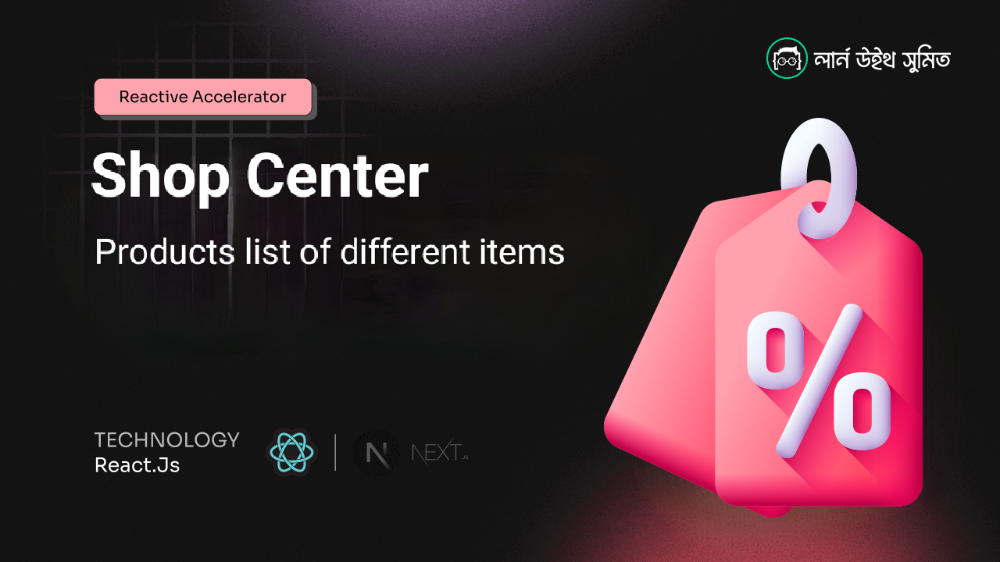
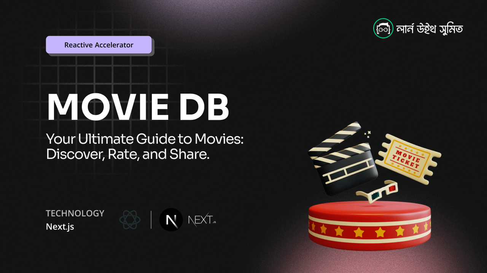
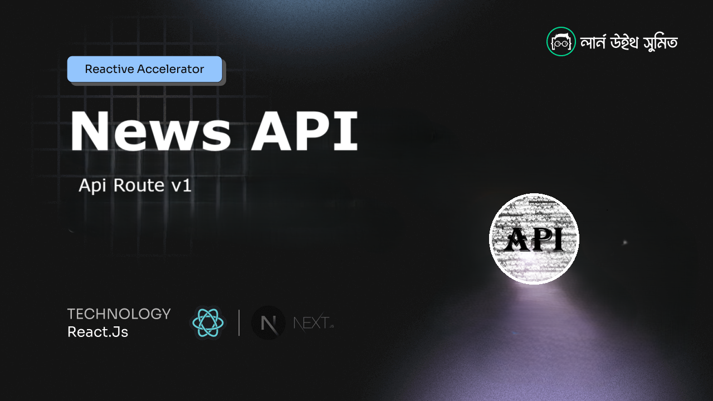

# Asssignments ( _NextJs_ | _ReactJs_ )

## Next JS Projects



### Shop Center | [Code](/shop-center) | [Preview](https://solimanhossain-assignment-6-shop-center.vercel.app/) |

```
cd shop-center
npm install
npm run dev
```

---



### Movie DB | [Code](/movie-db) | [Preview](https://solimanhossain-assignment-7-movie-db.vercel.app/) |

```
cd movie-db
npm install
npm run dev
```

---



### News API | [Code](/news-api) | [Preview](https://sol-news-api.vercel.app/) |

```
cd news-api
npm install
npm run dev
```

---

<br>

## React JS Projects

---


### News Feeder | [Code](/news-feeder) | [Preview](https://solimanhossain-assignment-4-news-feeder.vercel.app/) |

```
cd news-feeder
npm install
npm run dev
```

---


### Book Finder | [Code](/book-finder) | [Preview](https://solimanhossain-assignment-2-book-finder-app.vercel.app/) |

```
cd book-finder
npm install
npm run dev
```

---


### Smart Grade Showcase | [Code](/smartgrade-showcase) | [Preview](https://solimanhossain-assignment-1-smartgrade-showcase.vercel.app/) |

```
cd smartgrade-showcase
npm install
npm run dev
```

---

<br>

> HTML template are provided by Learn with Sumit ([repo: rnext](https://github.com/Learn-with-Sumit/rnext/)).

> These assignments of reactive accelerator course done by myself ([Soliman Hossain](https://github.com/solimanhossain/)).

> To run projects clone repo and install [Node.js](https://nodejs.org/en/download/) then run code on cmd or terminal follow url.

> To know more read documentations of [React](https://react.dev/) and [Next](https://nextjs.org/).
